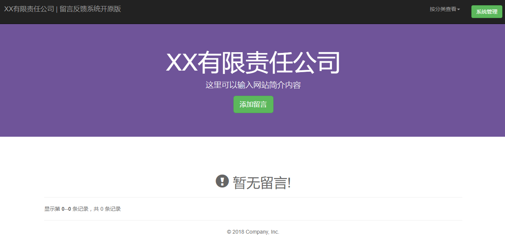
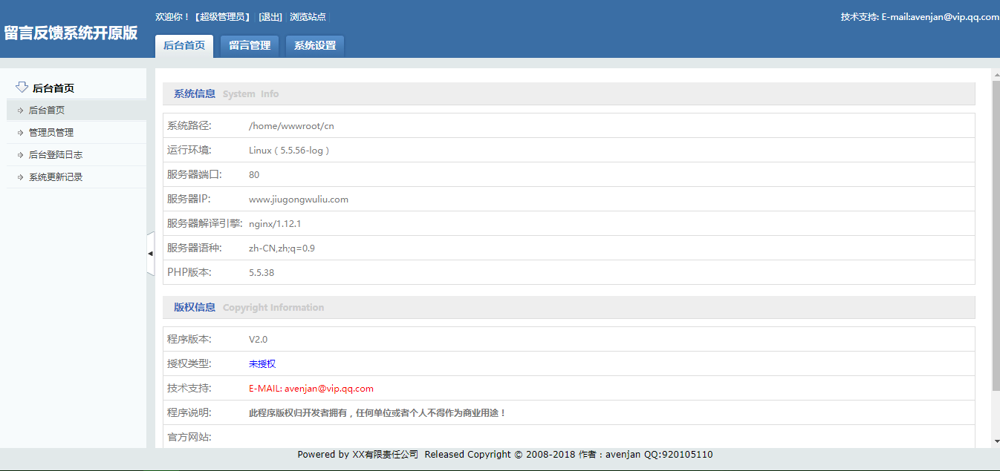

# 留言管理系统 开源版
  
#### 本系统是由avenjan二次开发的一套适用于中小企业及个人网站的留言反馈管理程序系统，基于 PHP + MySQL + Bootstrap 开发，开源免费使用。

####[国内镜像](https://gitee.com/avenjan/message_management_system)

   

> PHP`>=5.3.0`

## 作者
> 作者: `avenjan`

> 邮箱：`avenjan@vip.qq.com`

## 界面

#### 首页

#### 后台登陆

#### 后台首页

## 使用
下载本系统上传至服务器，通过浏览器访问程序URL执行安装过程。
初始用户名密码为admin/admin安装后可在后台修改。

